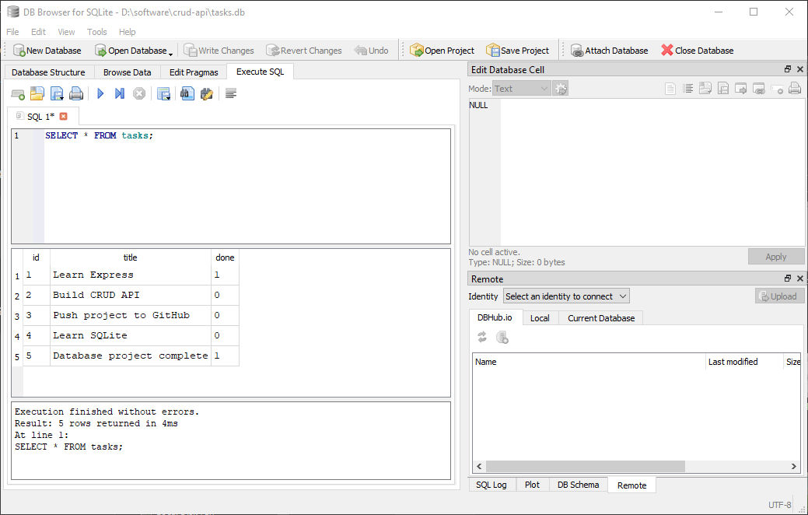

# CRUD API

A RESTful CRUD API built with Node.js, Express.js, and SQLite.

This project is an upgrade of the Week 2 CRUD API.
The API endpoints remain the same, but task data is now stored
in SQLite instead of memory.

## Technologies

- Node.js
- Express.js
- SQLite
- better-sqlite3
- Swagger UI
- OpenAPI 3.0

## Why SQLite?

SQLite was chosen because:

- It is a single database file.
- It requires no separate database server.
- It requires minimal setup.
- Data survives server restarts.

## Database

The database is stored in:

tasks.db

The file is created automatically when the application starts.

The database contains a `tasks` table with:

- `id`
- `title`
- `done`

The database file is ignored by Git so every clone creates
its own fresh database.

## Installation

```bash
npm install

## Running the Application

Start the server:

```bash
node index.js
```

The API runs at:

```
http://localhost:3000
```

Swagger documentation is available at:

```
http://localhost:3000/docs
```

---

## API Endpoints

| Method | Endpoint | Description |
|---------|----------|-------------|
| GET | `/` | API information |
| GET | `/health` | Health check |
| GET | `/tasks` | Get all tasks |
| GET | `/tasks/{id}` | Get task by ID |
| POST | `/tasks` | Create a new task |
| PUT | `/tasks/{id}` | Update an existing task |
| DELETE | `/tasks/{id}` | Delete a task |

---

## Example Request

Create a new task:

```bash
curl -i -X POST http://localhost:3000/tasks \
-H "Content-Type: application/json" \
-d '{"title":"Buy milk"}'
```

Example response:

```http
HTTP/1.1 201 Created
Content-Type: application/json

{
  "id": 4,
  "title": "Buy milk",
  "done": false
}
```

---

## HTTP Status Codes

| Status Code | Meaning |
|--------------|---------|
| 200 | Successful request |
| 201 | Resource created |
| 204 | Resource deleted successfully |
| 400 | Invalid request body |
| 404 | Task not found |

---

## Swagger UI

Interactive API documentation is available at:

```
http://localhost:3000/docs
```

### Screenshot


