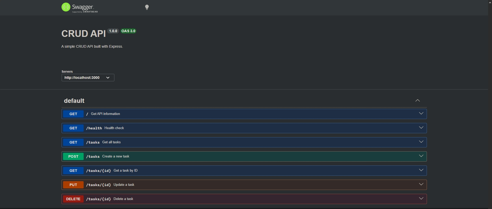

# Task API

A simple RESTful CRUD API built with **Node.js** and **Express.js** as part of the **FlyRank Backend Internship – Week 2 Assignment**.

The API allows users to create, read, update, and delete tasks. It stores data in memory and provides interactive API documentation using **Swagger UI**.

---

## Features

- Create a new task
- View all tasks
- View a task by ID
- Update an existing task
- Delete a task
- Input validation
- Proper HTTP status codes
- Interactive Swagger UI documentation

---

## Technologies Used

- Node.js
- Express.js
- Swagger UI Express
- OpenAPI 3.0
- Git
- GitHub

---

## Project Structure

```
crud-api/
│── screenshots/
│   └── swagger-ui.png
│
│── index.js
│── openapi.json
│── package.json
│── package-lock.json
│── README.md
└── .gitignore
```

---

## Installation

Clone the repository:

```bash
git clone https://github.com/shahateqx/crudapi-flyrank.git
```

Go into the project folder:

```bash
cd crudapi-flyrank
```

Install dependencies:

```bash
npm install
```

---

## Running the Application

Start the server:

```bash
node index.js
```

The API runs at:

```
http://localhost:3000
```

Swagger documentation is available at:

```
http://localhost:3000/docs
```

---

## API Endpoints

| Method | Endpoint | Description |
|---------|----------|-------------|
| GET | `/` | API information |
| GET | `/health` | Health check |
| GET | `/tasks` | Get all tasks |
| GET | `/tasks/{id}` | Get task by ID |
| POST | `/tasks` | Create a new task |
| PUT | `/tasks/{id}` | Update an existing task |
| DELETE | `/tasks/{id}` | Delete a task |

---

## Example Request

Create a new task:

```bash
curl -i -X POST http://localhost:3000/tasks \
-H "Content-Type: application/json" \
-d '{"title":"Buy milk"}'
```

Example response:

```http
HTTP/1.1 201 Created
Content-Type: application/json

{
  "id": 4,
  "title": "Buy milk",
  "done": false
}
```

---

## HTTP Status Codes

| Status Code | Meaning |
|--------------|---------|
| 200 | Successful request |
| 201 | Resource created |
| 204 | Resource deleted successfully |
| 400 | Invalid request body |
| 404 | Task not found |

---

## Swagger UI

Interactive API documentation is available at:

```
http://localhost:3000/docs
```

### Screenshot



---

## Notes

This project stores data **in memory**, so all tasks are reset whenever the server restarts. No database is used in this version.

---

## What I Learned

During this project I learned how to:

- Build a RESTful API using Express.js
- Implement CRUD operations
- Work with HTTP methods and status codes
- Validate incoming request data
- Create interactive API documentation using Swagger UI
- Use Git and GitHub for version control

---

## Author

**Md. Shajjat Hossain Shahat**