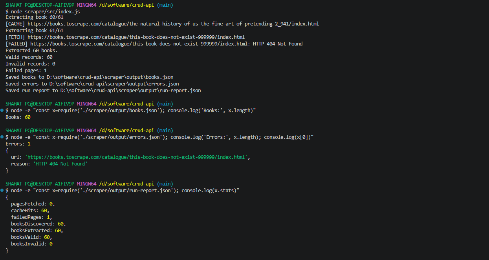

# Polite Scraper

A small scraping pipeline for the FlyRank Backend Track Week 5 Assignment A9.

## Target Classification

### Target

Books to Scrape:

https://books.toscrape.com/

Books to Scrape is a public practice sandbox created for learning and practicing web scraping.

### Scope

This scraper collects data from the first three catalogue pages only.

The three catalogue pages contain 60 unique books in total. The scraper discovers the book links from those catalogue pages and visits the individual book pages.

The scraper does not attempt to crawl the entire Books to Scrape catalogue.

### Data Collected

For each book, the scraper collects:

- title
- product URL
- price text
- availability text
- rating text
- description
- source page
- fetched timestamp

The records are then normalized and validated before being written to JSON.

### Robots Check

I requested:

https://books.toscrape.com/robots.txt

The server returned:

HTTP/1.1 404 Not Found

Therefore, no robots file was found.

A missing robots file is not treated as permission to scrape. This assignment targets Books to Scrape because it is explicitly provided as a public practice sandbox.

### JavaScript Check

The core scraping target is Books to Scrape.

The main catalogue and individual book pages expose the required book information directly in the returned HTML. The core scraper therefore uses ordinary HTTP requests and HTML parsing rather than browser automation.

A separate browser comparison is included as an evaluation of a JavaScript-heavy scraping lane. It is not required for the core Books to Scrape pipeline.

## Installation

From the `scraper` directory, install the scraper dependencies:

    npm install

If running from the project root:

    cd scraper
    npm install

## Running the Scraper

From the `scraper` directory:

    node src/index.js

Or from the project root:

    node scraper/src/index.js

The scraper creates:

    scraper/cache/
    scraper/output/

The generated output files are:

    scraper/output/book-urls.json
    scraper/output/books.json
    scraper/output/errors.json
    scraper/output/run-report.json

The `cache/` and `output/` directories are ignored by Git because they contain generated runtime data.

## Pipeline

The scraper is organized as a small pipeline:

1. Fetch and cache HTML.
2. Discover the first three catalogue pages.
3. Discover unique book URLs.
4. Extract book details.
5. Normalize the price.
6. Validate records with Zod.
7. Save valid books.
8. Save extraction and validation errors.
9. Save a run report.

The expected result for the assignment is:

    3 catalogue pages
    60 unique book URLs
    60 extracted books
    60 valid books
    0 validation errors

A deliberately invalid test URL can also be used to verify failure handling.

## Schema

Each valid book record contains these fields:

    {
      "title": "string",
      "product_url": "https://...",
      "price_text": "£51.77",
      "price_gbp": 51.77,
      "availability_text": "In stock",
      "rating_text": "star-rating Three",
      "description": "string",
      "source_page": "https://...",
      "fetched_at": "2026-08-29T17:24:41.423Z"
    }

### Raw Fields

The scraper extracts these raw fields from the product page:

- `title`
- `product_url`
- `price_text`
- `availability_text`
- `rating_text`
- `description`
- `source_page`
- `fetched_at`

### Normalization

The raw price text is normalized into:

    price_gbp

For example:

    £51.77

becomes:

    "price_gbp": 51.77

The normalized price must be a non-negative number.

### Validation

The scraper uses Zod validation.

A valid record requires:

- a non-empty title
- a valid HTTPS product URL
- non-empty price text
- a non-negative numeric `price_gbp`
- non-empty availability text
- non-empty rating text
- a description string
- a valid HTTPS source URL
- a valid ISO datetime for `fetched_at`

Invalid records are not written to `books.json`. They are recorded in `errors.json`.

## Output Files

### `books.json`

Contains successfully extracted, normalized, and validated books.

For the normal three-page run:

    60 valid books

### `book-urls.json`

Contains the discovered unique product URLs.

Expected count:

    60

### `errors.json`

Contains extraction failures and validation failures.

A failure record has the form:

    {
      "url": "https://...",
      "reason": "HTTP 404 Not Found"
    }

A validation failure contains the normalized record and the validation reason.

### `run-report.json`

Contains run-level evidence, including:

- start time
- finish time
- duration
- start URL
- catalogue pages
- page statistics
- extracted book count
- valid book count
- invalid book count
- failure count

Example successful cached run:

    {
      "started_at": "2026-08-29T17:24:41.423Z",
      "finished_at": "2026-08-29T17:24:41.692Z",
      "duration_ms": 269,
      "start_url": "https://books.toscrape.com/",
      "catalogue_pages": [
        "https://books.toscrape.com/",
        "https://books.toscrape.com/catalogue/page-2.html",
        "https://books.toscrape.com/catalogue/page-3.html"
      ],
      "stats": {
        "pagesFetched": 0,
        "cacheHits": 60,
        "failedPages": 0,
        "booksDiscovered": 60,
        "booksExtracted": 60,
        "booksValid": 60,
        "booksInvalid": 0
      },
      "errors_count": 0
    }

The `pagesFetched` value can be zero on a cached run because previously downloaded HTML is reused.

## Politeness and Reliability

The scraper identifies itself with:

    FlyRank-Week5-Scraper/1.0 (educational assignment)

The scraper uses the following request controls:

- minimum 500 ms interval between real HTTP requests
- 10 second request timeout
- HTTP status checking
- local HTML caching
- retry for timeouts
- retry for HTTP 5xx server errors
- no retry for HTTP 4xx client errors

The retry policy allows a maximum of two attempts for retryable failures.

A cached response does not make another network request.

This keeps repeated development runs from unnecessarily requesting the target server.

I will not reuse this code on another site without checking that site's rules, terms, and appropriate scraping constraints first.

## Failure Handling

The scraper does not allow one failed book page to terminate the entire extraction run.

If an individual book request fails:

1. The failure is logged.
2. The URL and error reason are added to the extraction error list.
3. The scraper continues with the remaining book URLs.
4. The failed page is counted in `failedPages`.
5. The final `run-report.json` records the failure count.

For example, a deliberately invalid URL:

    https://books.toscrape.com/catalogue/this-book-does-not-exist-999999/index.html

produces:

    HTTP 404 Not Found

The 404 is recorded as an error and is not retried.

## Successful Run Evidence

A successful cached run produced:

    Discovered 60 unique book URLs.
    Extracted 60 books.
    Valid records: 60
    Invalid records: 0
    Failed pages: 0

The generated run report showed:

    pagesFetched: 0
    cacheHits: 60
    failedPages: 0
    booksDiscovered: 60
    booksExtracted: 60
    booksValid: 60
    booksInvalid: 0

The generated files were:

    scraper/output/books.json
    scraper/output/errors.json
    scraper/output/book-urls.json
    scraper/output/run-report.json

Because `scraper/output/` is ignored by Git, these files are generated locally by running the documented command.

## Why No Browser Is Required for the Core Scraper

The core assignment target is Books to Scrape.

The required catalogue and book information is present in the HTML returned by ordinary HTTP requests. Cheerio can parse that HTML directly, so a browser is unnecessary for the main extraction pipeline.

A browser is useful when a site requires JavaScript execution to produce the content that must be scraped. That is a different scraping lane from this core Books to Scrape task.

Using ordinary HTTP requests for this target also keeps the scraper simpler and reduces resource usage compared with browser automation.

## Browser Comparison

For the JavaScript-heavy comparison lane, the assignment uses:

    https://quotes.toscrape.com/js

The purpose of the comparison is to demonstrate the difference between:

    plain HTTP request

and:

    browser automation with Playwright

The comparison should record:

- whether the required content appears in the plain HTTP response
- whether browser rendering is required
- elapsed time
- approximate memory usage
- why the browser is or is not justified

This browser comparison is separate from the core Books to Scrape pipeline.

## Ethics Note

This scraper is intended for an educational scraping exercise against a public practice sandbox.

The implementation deliberately limits scope to three catalogue pages, identifies itself with an honest User-Agent, spaces requests, caches downloaded pages, uses timeouts, and avoids retrying client errors.

The code should not automatically be treated as suitable for arbitrary websites. Before scraping another site, its robots rules, terms, access restrictions, rate limits, and other applicable requirements should be checked.

## Project Structure

    crud-api/
    ├── scraper/
    │   ├── .gitignore
    │   ├── README.md
    │   ├── src/
    │   │   └── index.js
    │   ├── cache/
    │   └── output/
    ├── screenshots/
    ├── index.js
    ├── openapi.json
    ├── package.json
    └── package-lock.json

The generated `cache/` and `output/` directories are ignored by Git.

## Git History

The scraper was developed incrementally in meaningful stages:

- W5 Stage 0: classify scraping target
- Stage 1: fetch and cache HTML
- Stage 2: discover catalogue pages and book URLs
- Stage 3: extract book details
- Stage 4: validate and normalize scraped books
- Stage 5: add book pagination search and sorting
- Stage 6: document books API in OpenAPI
- Stage 7: add scraper retries and run reporting

The scraper work is maintained as separate commits so that the development history shows the progression of the implementation.

## Assignment Result

The completed scraper demonstrates:

- target classification
- bounded crawling
- catalogue pagination discovery
- unique URL discovery
- HTML extraction
- normalization
- schema validation
- caching
- polite request spacing
- timeout handling
- retry handling
- graceful per-page failure handling
- JSON outputs
- run-level reporting
- a documented JavaScript/browser comparison lane
  
## Broken URL Test Evidence

The scraper was tested with one deliberately invalid book URL.

The invalid page returned `HTTP 404 Not Found`, while the scraper continued running and preserved all 60 valid books.

